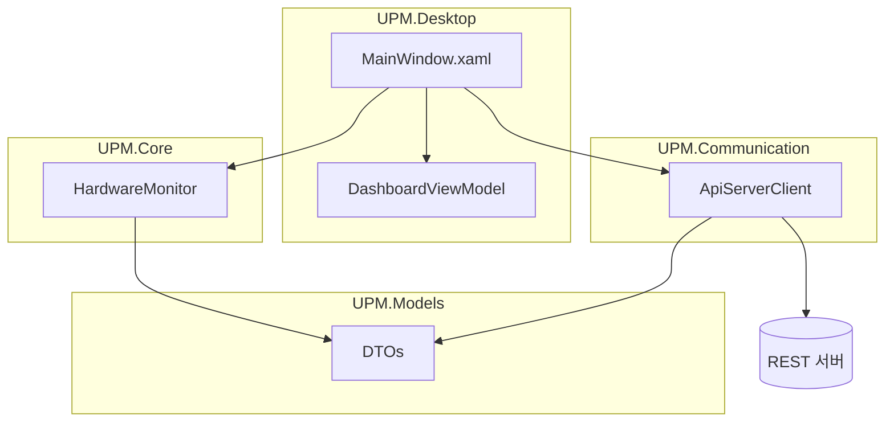

# UPM — Universal PC Master

Windows PC의 하드웨어·리소스를 실시간으로 보여 주고, 선택적으로 원격 서버로 메트릭을 보내는 **WPF 데스크톱** 프로젝트입니다.

README 구성은 [yewon-Noh/readme-template (backend)](https://github.com/yewon-Noh/readme-template/tree/main/backend) 스타일을 참고했습니다.

---

## 소개

- **SYSTEM RESOURCES**: CPU/GPU/RAM/메인보드 사양을 테이블로 표시
- **GAUGES**: CPU·RAM·GPU(온도) 도넛 게이지 (LiveChartsCore)
- **메모리 사용 상위**: 작업 집합 기준 상위 프로세스 목록, 토글로 표시/숨김
- **QUICK BOOST**: 지정된 유형의 프로세스 정리(실제 동작은 `HardwareMonitor` 구현 참고)
- **서버 연동**: `HttpClient`로 JSON POST (서버 미기동 시 콘솔에 오류 로그만 출력)

---

## 화면 구성

| 구역 | 설명 |
|:---:|:---|
| 상단 좌 | SYSTEM RESOURCES 패널 (항목 / 사양) |
| 상단 우 | UPM 타이포 + **QUICK BOOST** |
| 중단 | **GAUGES** — CPU / RAM / GPU 도넛 차트 |
| 하단 | **메모리 사용 상위** — PID·메모리, 토글로 접기 |

> 스크린샷·GIF는 저장소에 추가한 뒤 위 표를 `| 이미지 | 이미지 |` 형태로 바꿔 쓰면 됩니다.

---

## APIs

클라이언트가 호출하는 REST 경로와 페이로드 요약은 아래 문서에 정리했습니다.

👉 [APIs.md](./APIs.md) 바로보기

---

## 기술 스택

### Desktop / Runtime

| 구분 | 기술 |
|:---|:---|
| 언어 / 런타임 | C# 12, **.NET 8** |
| UI | **WPF** |
| 대상 OS | **Windows 10 1809 (빌드 17763) 이상** (`net8.0-windows10.0.19041.0`) |
| 차트 | **LiveChartsCore.SkiaSharpView.WPF** 2.0.x |
| 모니터링 | **LibreHardwareMonitorLib**, `System.Management`(WMI), `PerformanceCounter` |

### Libraries

| 프로젝트 | 역할 |
|:---|:---|
| `UPM.Desktop` | WPF 앱, UI·타이머·VM 연동 |
| `UPM.Core` | 하드웨어 수집, 프로세스 상위, Boost |
| `UPM.Communication` | `ApiServerClient` (HttpClient + `System.Net.Http.Json`) |
| `UPM.Models` | `SystemStatusModel`, `HardwareSpecModel`, `ProcessInfoModel` 등 DTO |

### Tools

- Visual Studio 2022 또는 VS Code + C# 확장  
- [.NET 8 SDK](https://dotnet.microsoft.com/download/dotnet/8.0)

---

## 프로젝트 아키텍처



솔루션 폴더 구조 요약:

| 경로 | 설명 |
|:---|:---|
| `Apps/UPM.Desktop/` | 실행 진입점, XAML, `Converters/` |
| `Libraries/UPM.Core/` | 모니터링·최적화 |
| `Libraries/UPM.Communication/` | HTTP 클라이언트 |
| `Shared/UPM.Models/` | 공유 모델 |

---

## 기술적 이슈와 해결 과정

- **PieChart가 항상 100%로만 보이던 문제**  
  - `PieSeries`에 값이 하나면 전체 호가 되므로, **채움 + 트랙(합 100)** 두 시리즈로 분리해 비율 표시.
- **`NU1701` (net461 폴백) 경고**  
  - Desktop 타깃을 `net8.0-windows10.0.19041.0`으로 올려 LiveCharts 전이 의존성 경고를 제거.
- **빌드 시 DLL/PDB 복사 실패 (MSB3027)**  
  - `dotnet run`/디버거가 출력 폴더를 잠금 → **실행 중지 후 빌드**. 루트 `Directory.Build.props`에 복사 재시도 횟수 완화.
- **`dotnet run` 후 창이 안 뜸**  
  - `app.manifest`의 `requireAdministrator`를 **`asInvoker`**로 변경.  
  - 토글 `IsChecked`가 로드 중 `Checked`를 일으켜 **null 참조**가 나던 부분은 `ApplyProcessListVisibility`에서 **null / `IsLoaded` 가드**로 처리.
- **미사용 패키지**  
  - 코드에서 쓰이지 않는 **LiveCharts.Wpf** 패키지 참조 제거.

---

## 시작하기

### 사전 요구 사항

- Windows 10 1809 이상 (Desktop TFM 기준)
- [.NET 8 SDK](https://dotnet.microsoft.com/download/dotnet/8.0)

### 빌드 및 실행

```powershell
cd src/UPM
dotnet build UPM.sln -c Release
dotnet run --project Apps/UPM.Desktop/UPM.Desktop.csproj
```

### 서버 URL 변경

`Apps/UPM.Desktop/MainWindow.xaml.cs` 생성자에서:

```csharp
_apiClient = new ApiServerClient("http://localhost:8000");
```

원하는 `baseUrl`로 바꿉니다. 서버가 없으면 주기적 전송은 실패 로그만 남습니다.

---

## 프로젝트 팀원

| 역할 | 비고 |
|:---:|:---|
| Maintainer | *(GitHub 프로필·이름을 추가하세요)* |

---

## 라이선스

개인·교육 목적으로 작성된 프로젝트입니다. 필요 시 저장소 루트에 `LICENSE`를 추가하세요.
