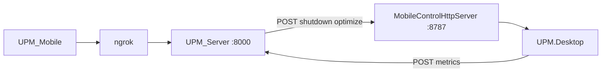

# UPM — Universal PC Manager

Windows PC의 하드웨어·리소스를 실시간으로 보여 주고, 선택적으로 원격 서버로 메트릭을 보내는 **WPF 데스크톱** 프로젝트입니다.

README 구성은 [yewon-Noh/readme-template (backend)](https://github.com/yewon-Noh/readme-template/tree/main/backend) 스타일을 참고했습니다.

---

## 소개

- **SYSTEM RESOURCES**: CPU/GPU/RAM/메인보드 사양을 테이블로 표시
- **GAUGES**: CPU·RAM·GPU(온도) 도넛 게이지 (LiveChartsCore)
- **메모리 사용 상위**: 작업 집합 기준 상위 프로세스 목록, 토글로 표시/숨김
- **QUICK BOOST**: 서버 분석(killList) 기반으로 불필요한 프로세스를 정리하고, 서버 미연결 시 로컬 규칙으로 폴백
- **서버 연동**: `HttpClient`로 JSON POST (서버 미기동 시 콘솔에 오류 로그만 출력)

---

## 최근 변경 사항 (juntak 브랜치)

**서버 기반 스마트 최적화**와 **UI 성능 개선**을 중심으로 코드를 수정했습니다. 팀원이 리뷰하기 쉽도록 파일별·주제별로 정리했습니다.

### 한눈에 보기

| 파일 | 핵심 변경 |
|:---|:---|
| `Apps/UPM.Desktop/MainWindow.xaml.cs` | 수집 작업을 **백그라운드 스레드**로 이동해 UI 버벅임 제거 + **틱 재진입 가드** 추가 / QUICK BOOST를 **서버 분석 기반**으로 변경(실패 시 로컬 폴백) |
| `Libraries/UPM.Core/HardwareMonitor.cs` | 상위 N개 프로세스 **CPU 사용률 측정** 추가 / **보호 목록·자기 자신·사용자 세션** 기반 종료 안전장치 / 규칙 기반 종료 `OptimizeSystemByRules` |
| `Libraries/UPM.Communication/ApiServerClient.cs` | 최적화 **분석 요청**·**결과 보고** API 2종 추가 |
| `Shared/UPM.Models/SystemStatusModel.cs` | `HasVisibleWindow`, `CpuPercent`, `IsCurrentUserOwned` 필드 추가 |
| `Apps/UPM.Desktop/app.manifest` | 프로세스 종료 권한 확보를 위해 `requireAdministrator`로 상향 |

### 1. 서버 기반 스마트 최적화 (QUICK BOOST)

기존에는 하드코딩된 유형의 프로세스만 정리했지만, 이제 **서버가 분석한 종료 대상 목록(killList)** 을 받아 정리합니다.

1. 현재 상태(머신 ID · 프로세스 목록)를 수집해 서버에 최적화 분석 요청
2. 서버 응답(killList)이 있으면 **규칙 기반 종료**(`OptimizeSystemByRules`), 없으면 기존 하드코딩 방식으로 **폴백**
3. 실제 종료된 목록을 서버에 **보고**(이력 저장용)

> 서버 통신이 실패해도 예외를 잡아 기존 로컬 최적화로 폴백하므로 앱은 항상 동작합니다.

### 2. UI 성능 개선 (버벅임 제거)

- 무거운 수집 작업(전체 프로세스 열거 + CPU 500ms 샘플링)을 `Task.Run`으로 **백그라운드 스레드**에서 실행 → UI 스레드 비블로킹
- `_isTicking` **재진입 가드**로, 이전 수집이 끝나지 않은 상태에서 다음 타이머 틱이 겹쳐 도는 것을 방지
- CPU 사용률은 전체가 아닌 **메모리 상위 N개** 프로세스에만 측정해 부하 최소화

### 3. 프로세스 종료 안전장치 (이중 보호)

실수로 시스템·개발 도구·앱 자신을 종료하지 않도록 여러 겹의 안전장치를 넣었습니다.

- **하드코딩 보호 목록**(`_protectedProcessNames`): VS/빌드 툴체인, 런타임·서버, 셸·터미널·git 등. 서버가 killList에 넣어도 클라이언트가 최종 거부 (서버 `HARD_PROTECT`와 동일하게 유지)
- **자기 자신 보호**(`IsSelf`): UPM 앱 자신의 PID/이름은 절대 종료하지 않음
- **사용자 세션 소유 확인**(`IsCurrentUserOwned`): SYSTEM/서비스(세션 0) 프로세스 구분
- 종료는 `Kill` + `WaitForExit`로 **실제 종료가 확인된 항목만** 성공 목록에 기록

### 4. 신규 API

| 메서드 | 경로 | 설명 |
|:---|:---|:---|
| `RequestOptimizationAsync` | `POST /api/v1/optimization/analyze` | machineId·프로세스 목록 전송 → 종료 대상 `killList` 수신 |
| `ReportKilledProcessesAsync` | `POST /api/v1/optimization/report` | 실제 종료된 프로세스 목록 보고(실패해도 앱 동작 무영향) |

### 5. 모델 필드 추가 (`ProcessInfoModel`)

| 필드 | 타입 | 설명 |
|:---|:---|:---|
| `HasVisibleWindow` | `bool` | 가시 창 보유 여부 |
| `CpuPercent` | `double` | 프로세스 CPU 사용률(상위 N개만 측정) |
| `IsCurrentUserOwned` | `bool` | 현재 사용자 세션 소유 여부 |

---

## 화면 구성

| 구역 | 설명 |
|:---:|:---|
| 상단 좌 | SYSTEM RESOURCES 패널 (항목 / 사양) |
| 상단 우 | UPM 타이포 + **QUICK BOOST** |
| 중단 | **GAUGES** — CPU / RAM / GPU 도넛 차트 |
| 하단 | **메모리 사용 상위** — PID·메모리, 토글로 접기 |

> 스크린샷·GIF는 저장소에 추가한 뒤 위 표를 `| 이미지 | 이미지 |` 형태로 바꿔 쓰면 됩니다.

---

## APIs

클라이언트가 호출하는 REST 경로와 페이로드 요약은 아래 문서에 정리했습니다.

👉 [APIs.md](./APIs.md) 바로보기

---

## 기술 스택

### Desktop / Runtime

| 구분 | 기술 |
|:---|:---|
| 언어 / 런타임 | C# 12, **.NET 8** |
| UI | **WPF** |
| 대상 OS | **Windows 10 1809 (빌드 17763) 이상** (`net8.0-windows10.0.19041.0`) |
| 차트 | **LiveChartsCore.SkiaSharpView.WPF** 2.0.x |
| 모니터링 | **LibreHardwareMonitorLib**, `System.Management`(WMI), `PerformanceCounter` |

### Libraries

| 프로젝트 | 역할 |
|:---|:---|
| `UPM.Desktop` | WPF 앱, UI·타이머·VM 연동 |
| `UPM.Core` | 하드웨어 수집, 최적화, 전원 제어, 모바일 제어 HTTP 서버 |
| `UPM.Communication` | 메트릭 전송 `ApiServerClient` |
| `UPM.Models` | `SystemStatusModel`, `HardwareSpecModel`, `ProcessInfoModel` 등 DTO |

### Tools

- Visual Studio 2022 또는 VS Code + C# 확장  
- [.NET 8 SDK](https://dotnet.microsoft.com/download/dotnet/8.0)

---

## 프로젝트 아키텍처



솔루션 폴더 구조 요약:

| 경로 | 설명 |
|:---|:---|
| `Apps/UPM.Desktop/` | 실행 진입점, XAML, `Converters/` |
| `Libraries/UPM.Core/` | `HardwareMonitor`, `SystemPowerController`, `MobileControlHttpServer`, `UpmAppSettings` |
| `Libraries/UPM.Communication/` | `ApiServerClient` |
| `Shared/UPM.Models/` | 공유 모델 |

---

## 기술적 이슈와 해결 과정

- **PieChart가 항상 100%로만 보이던 문제**  
  - `PieSeries`에 값이 하나면 전체 호가 되므로, **채움 + 트랙(합 100)** 두 시리즈로 분리해 비율 표시.
- **`NU1701` (net461 폴백) 경고**  
  - Desktop 타깃을 `net8.0-windows10.0.19041.0`으로 올려 LiveCharts 전이 의존성 경고를 제거.
- **빌드 시 DLL/PDB 복사 실패 (MSB3027)**  
  - `dotnet run`/디버거가 출력 폴더를 잠금 → **실행 중지 후 빌드**. 루트 `Directory.Build.props`에 복사 재시도 횟수 완화.
- **토글 로드 중 null 참조**  
  - 토글 `IsChecked`가 로드 중 `Checked`를 일으켜 **null 참조**가 나던 부분은 `ApplyProcessListVisibility`에서 **null / `IsLoaded` 가드**로 처리.
- **관리자 권한 (프로세스 종료)**  
  - QUICK BOOST가 보호되지 않은 타 프로세스를 종료하려면 상승 권한이 필요하여 `app.manifest`를 **`requireAdministrator`**로 설정. 실행 시 UAC 동의가 필요합니다.
- **미사용 패키지**  
  - 코드에서 쓰이지 않는 **LiveCharts.Wpf** 패키지 참조 제거.

---

## 시작하기

### 사전 요구 사항

- Windows 10 1809 이상 (Desktop TFM 기준)
- [.NET 8 SDK](https://dotnet.microsoft.com/download/dotnet/8.0)

### 빌드 및 실행

```powershell
cd src/UPM
dotnet build UPM.sln -c Release
dotnet run --project Apps/UPM.Desktop/UPM.Desktop.csproj
```

### 연동 실행 순서 (모바일 포함)

1. **UPM.Desktop** 실행 (로컬 제어 포트 `8787` 리스닝)
2. **UPM_Server**: `python main.py` (`0.0.0.0:8000`)
3. **ngrok**: `ngrok http 8000` → URL을 UPM_Mobile `baseUrl`에 반영
4. **UPM_Mobile** 실행

### 설정 변경

`Libraries/UPM.Core/UpmAppSettings.cs`:

```csharp
public const string MetricsServerBaseUrl = "http://localhost:8000";
public const int MobileControlPort = 8787;
```

서버가 없으면 메트릭 전송 실패는 디버그 출력만 남고 UI는 계속 동작합니다.

---

## 프로젝트 팀원

| 역할 | 비고 |
|:---:|:---|
| Maintainer | [@Dungsu](https://github.com/Dungsu) |

---
